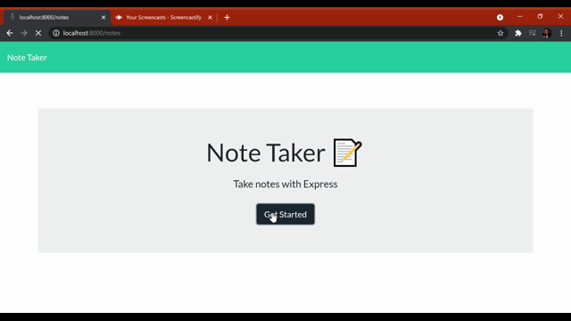

  
      
  [](https://opensource.org/licenses/MIT) 
  # Note Taker

  [Link to deployed application at Heroku](https://git.heroku.com/enigmatic-fjord-81157.git)
  ## Description
  A simple note taking app that allows user to view notes, input new notes, save it or delete it. This app was built with node.js(Using express).

  ## Table of Contents
  * [Installation](#installation)

  * [Usage](#usage)

  * [License](#license)

  * [Test](#tests)

  * [Contribute](#contribute)

  * [Questions](#questions)

  ## Installation
  
  To install, clone this project in your directory. Make sure to install node.js and NPM along with dependencies express,node-id. 
  Follow the following commands.
  ```bash
  install node.js
  npm init
  npm install express --save
  npm i node-id
  ```
  ## Usage
  To run this application locally follow the following command.
  ```bash
  npm start
  ```
  ## License
  This project is licensed under MIT license.

  [](https://opensource.org/licenses/MIT) 
  ## Tests
  No test available at the moment.
  ## Contribute
  No contribution at the moment.
  ## Questions
  For any questions, please contact 

  * lochan.sharad@gmail.com

  * [GitHub](https://github.com/best15)

